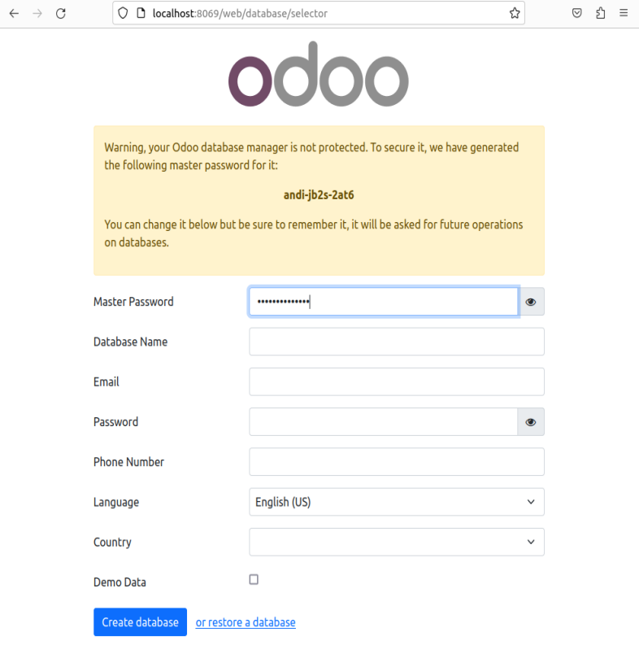
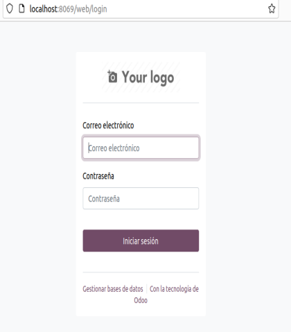
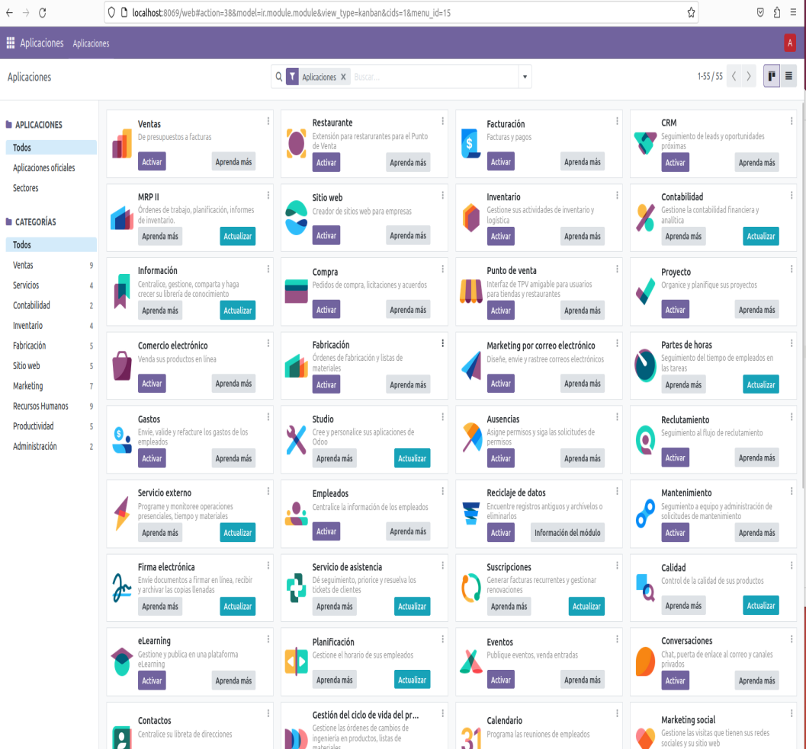
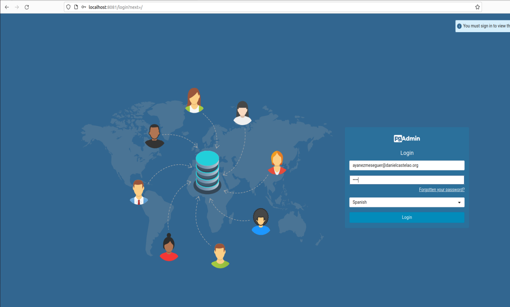
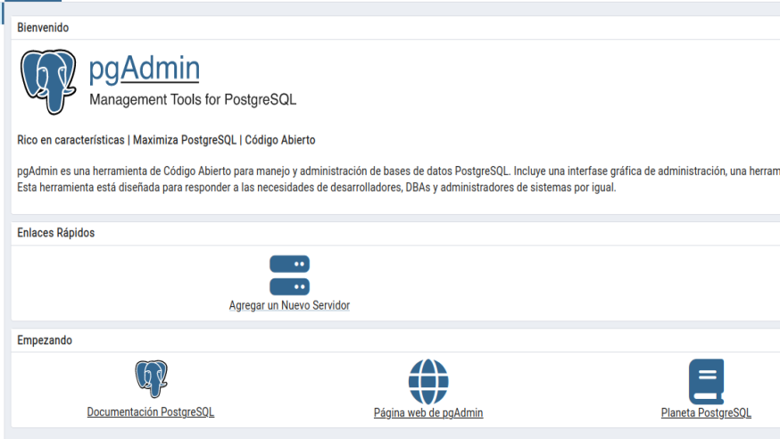
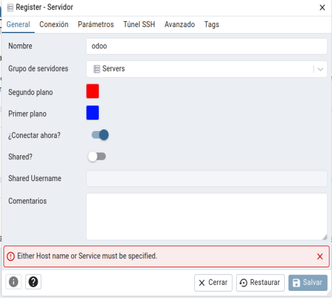
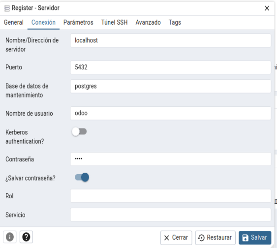
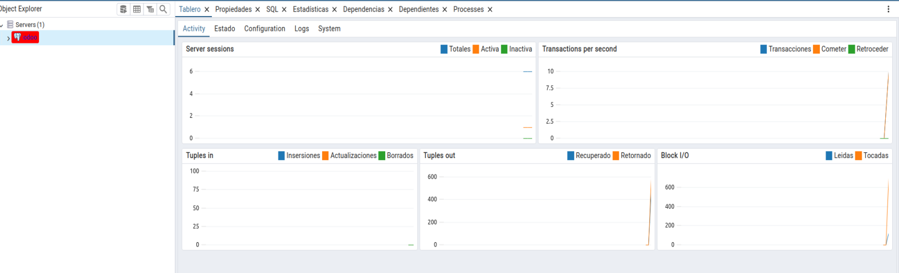

# Tarea10

## Índice
- [Explicación del Docker Compose](#explicación-del-docker-compose)
- [Realizacion de la tarea](#realizacion-de-la-tarea)
- [Preguntas de teoria](#Preguntas-de-teoria)

---

### 1. Servicio `web` (Odoo)
- **Imagen:** `odoo:17.0`. La imagen oficial de Odoo 17.
- **Dependencias:** Depende del servicio `db`.
- **Puertos:** Se expone el puerto `8069` del contenedor al `8069` del host (puerto por defecto de Odoo).

### 2. Servicio `db` (PostgreSQL)
- **Imagen:** `postgres:15`. La imagen oficial de PostgreSQL 15.
- **Puertos:** Se expone el puerto `5432` del contenedor al `5432` del host.
- **Variables de entorno:** Configuran la base de datos:
  - `POSTGRES_DB`: Nombre de la base de datos (por defecto, `postgres`).
  - `POSTGRES_USER`: Usuario para acceder a la base de datos (por defecto, `odoo`).
  - `POSTGRES_PASSWORD`: Contraseña del usuario (por defecto, `odoo`).

### 3. Servicio `pgadmin` (PgAdmin)
- **Imagen:** `dpage/pgadmin4`. La imagen oficial de PgAdmin 4.
- **Puertos:** Se expone el puerto `80` del contenedor al `8081` del host para acceder a PgAdmin desde el navegador.
- **Variables de entorno:**
  - `PGADMIN_DEFAULT_EMAIL`: Correo electrónico para iniciar sesión en PgAdmin.
  - `PGADMIN_DEFAULT_PASSWORD`: Contraseña para iniciar sesión en PgAdmin.
- **Dependencias:** Depende del servicio `db`.

---

## Una vez hecho el compose haremos lo siguiente

### 1. Inicia los servicios con Docker Compose
```bash
docker-compose up -d
```
Esto iniciará los contenedores en segundo plano.

### 2. Acceso a odoo
- para abrir odoo abrimos el navegador y ponemos lo siguiente `http://localhost:8069`.

### 3. Configura Odoo
- Sigue el asistente de configuración para crear la base de datos inicial.

- Lo primero que nos saldra es la siguiente pantalla en la que rellenaremos todos los campos para crear nuestra base de datos
  


- A continuacion iniciamos sesion para entrar a odoo



- Haciendo todo lo anterior como podremos ver en la siguiente imagen ya estariamos dentro de odoo




### 4. Conecta PgAdmin a PostgreSQL
-  para abrir PgAdmin abrimos el navegador y ponemos lo siguiente `http://localhost:8081`.

-  Nos saldra el siguiente formmulario donde iniciaremos sesion en PgAdmin



- Si lo hemos hecho bien podremos acceder sin problemas



- A continuacion debemos conectar odoo a pgadmin, para ello le daremos a agregar nuevo servidor y en general rellenamos los datos de nuestro servidor



- Luego iremos al siguiente apartado de conexion para conectarlo con odoo



- Si hemos puesto todos los datos bien deberiamos habernos conectado son problemas



---

## Preguntas teoricas

## ¿Que ocurre si en el ordenador local el puerto 5432 está ocupado? ¿Y si lo estuviese el 8069? ¿Como puedes solucionarlo?

### Puerto 5432 ocupado
- Si el puerto 5432 esta ocuoado no nos dejara usarlo y habria que mapearlo en otro por ejemplo el 5433 desde el docker compose poniendo lo siguiente:
  ```yaml
  ports:
    - "5433:5432"
  ```

### Puerto 8069 ocupado
- Al igual que en la pregunta anterior no podriamos usarlo para odoo y tendriamos que maparlo en otro de la misma manera que el anterior
  ```yaml
  ports:
    - "8070:8069"
  ```
